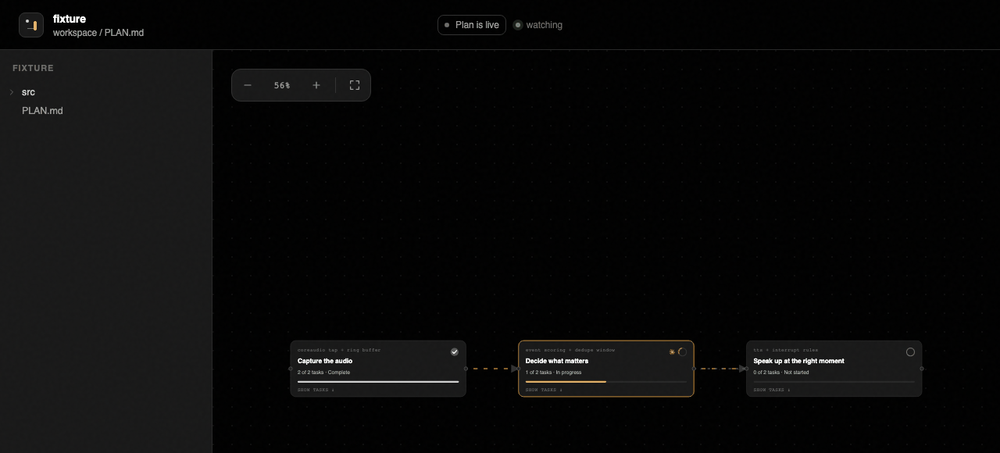

# agenttrail

A live map of what your coding agents are doing. Plan and position, watched in real time.

agenttrail watches your **repo**, not your agent. It renders the plan your agent maintains in `PLAN.md` as a live view: what's done, what's in progress right now, and what the agent is touching in the repo this second. Works with Claude Code, Codex, or any agent that can follow a file convention.

> agentmap helps your agent see your code. agenttrail helps you see your agent.



## quick start

```
npx agenttrail init          # scaffolds PLAN.md + writes the convention block to CLAUDE.md and AGENTS.md
npx agenttrail               # starts the daemon → http://localhost:5330
```

Then the one human step: the board shows a **Copy backfill prompt** button while the plan is a skeleton — paste that prompt to Claude Code or Codex in the repo, and the agent rewrites PLAN.md as the real component map. The board fills in live as it writes.

**All local, verifiably.** The daemon binds to 127.0.0.1 only — nothing is reachable from outside your machine, nothing leaves it, and there is zero telemetry. No cloud, no accounts. The optional Claude Code hooks are additive entries in your repo's gitignored `.claude/settings.local.json` (they relay tool events to your local daemon and nowhere else), and the whole tool is one dependency-free file you can read in a sitting: [`bin/agenttrail.mjs`](bin/agenttrail.mjs).

## the PLAN.md convention (the spec)

```markdown
# my project

## Capture the audio {#capture}
tech: coreaudio tap + ring buffer
- [x] Grab the mic feed {#capture-mic}
- [~] Keep the last 30 seconds ready {#capture-ring}
  tech: lock-free ring buffer

## Decide what matters {#classify}
needs: [capture]
links: [notify]
- [ ] Score events by urgency {#classify-score}

## decisions
- 2026-08-21: dropped redis for summaries; in-process queue instead
```

- nodes are **components** of the system (`## Plain-language name {#id}`), not phases — titles are verb-led outcomes the owner understands; the engineer phrasing lives on a `tech:` line and shows on drill-down
- every component and task carries a **stable `{#id}`** — never renamed, only added or removed
- `- [~]` marks the task in progress, `- [x]` done, `- [!]` stuck/failing — cards carry a status circle: green tick complete, amber spinner in progress, red `!` blocked
- open tasks carry a `from:` provenance line — `from: agent` (pink **Session plan** pill: an agent's own declared imminent intent; correct on sight if wrong) vs `from: roadmap` (muted **Roadmap** pill: planning-doc intent, durable and backloggable)
- an indented `by: <agent>` line under a task records who took it (claude, codex, …) — shown as a colored chip on the task and rolled up as agent dots on the component card; it stays after completion as the record of who built what
- `needs: [id]` = must come after those components (drawn as arrows); `links: [id]` = interconnected with (drawn as dashed ties)
- `files: [src/audio/**]` declares which paths a component owns — this powers the **observed-activity ring**: whenever a component's files are being written, an amber ring spins around its status circle no matter what the checkbox says (Revising on a done component, Retrying on a blocked one, Editing otherwise). Declared status and observed activity are independent layers, so revisiting finished work is never invisible
- plan-affecting decisions are recorded under `## decisions` **before** implementing them

`agenttrail init` writes the instruction block into both CLAUDE.md (Claude Code) and AGENTS.md (Codex, Cursor, and friends) — including the naming rule, so plans are written for the person supervising, not the agent doing. The monitor itself is agent-blind: it watches files, so anything that edits the repo shows up.

## live runs (Claude Code)

`init` also wires Claude Code hooks into the repo's `.claude/settings.local.json`. From then on every Claude session in that repo streams to the board: a **run card** per session — agent mark, elapsed time, the todo it's working on now, and the live tool line (`Bash · pnpm test · 41s`) — click to unfold the full todo list and recent tool calls. Runs pin to the component whose files they're editing, so the map glows where the 30-minute session actually is. Agents without hooks (Codex, anything else) still show through the file-activity layer.

## what you see

- phases and tasks with live status; the in-progress task carries a live "editing src/… · 4s ago" line from the fs watcher
- a pan/zoom flow diagram of the components — `needs:` edges as arrows, `links:` as dashed ties; click a node to unfold its tasks as capsules with per-task detail (including the `tech:` line)
- an inspector panel with phase progress, dependencies, and the latest repository activity

The monitor is read-only — it never modifies PLAN.md or anything else in your repo.

## architecture

Codebase-grounded: fs watcher + PLAN.md are the spine. Agent-specific event streams (Claude Code hooks etc.) are optional adapters that add fidelity — sub-second tool lines, subagent trees — but nothing breaks without them. Single zero-dependency node daemon serves the UI and an SSE model stream; every view is a stateless projection of one derived model.

## roadmap

- scryer teardown + positioning notes
- ARCHITECTURE.md layer: component globs, import-edge drift, deny rules
- Claude Code hooks adapter (live tool line, todo sync)
- menu bar / vscode / tui renderers on the same stream

MIT
